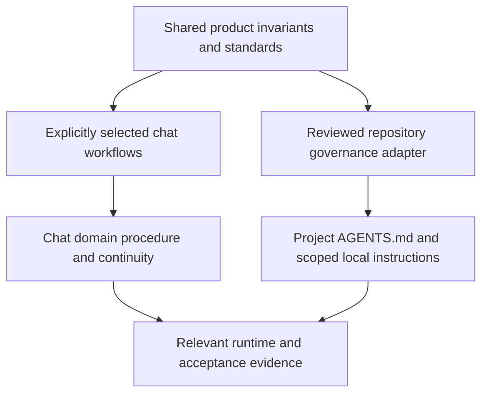

# Architecture

Shared product invariants feed two distinct instruction surfaces.

The nine [flagship components](Skills-Catalog) are chat workflows. In selected chats, the domain Skill owns procedure; Governance, Zero-Loss and Project Brain provide relevant acceptance/continuity overlays without resetting state.

Coding agents use project instructions and reviewed shared policy. They do not automatically load chat orchestration, catalogs, watchdogs or all-in-one contracts. [Repository Governance Sync](Repository-Governance-Sync) preserves local commands and checks adopted digests.

Tests, audits, runtime proof and visual review validate specific behavior. File parity does not guarantee semantic compliance, perfect design or agent quality.
